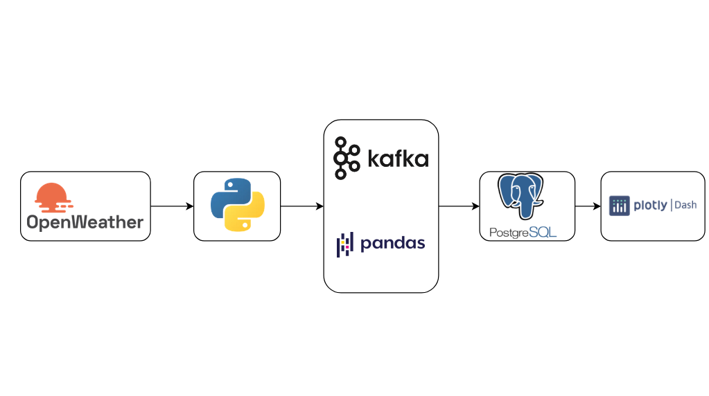
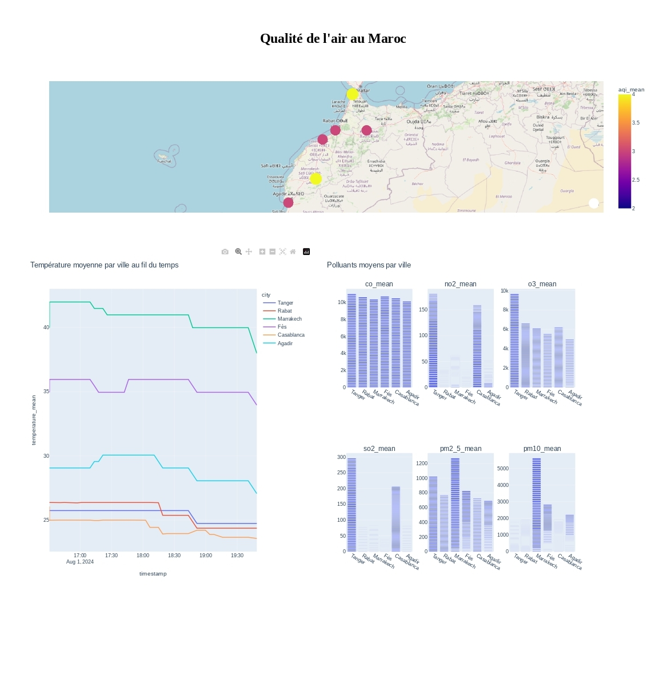

# Morocco Air Quality Monitoring System: Real-Time ETL Pipeline

## 🌍 Project Overview

An ETL pipeline that monitors and analyzes real-time air quality and weather data across major Moroccan cities. The system leverages big data technologies to process environmental data streams and generate actionable insights about air quality patterns and their correlation with weather conditions.



## 🎯 Key Features

- **Real-Time Data Collection**: Continuous monitoring of 6 major Moroccan cities
- **Comprehensive Air Quality Metrics**: Tracks multiple pollutants (CO, NO2, O3, SO2, PM2.5, PM10)
- **Weather Correlation Analysis**: Analyzes relationships between weather patterns and pollution levels
- **Statistical Analysis**: Provides rolling averages, correlations, and pollution threshold monitoring
- **Scalable Architecture**: Built with distributed systems (Kafka, Spark) for horizontal scaling

## 🏗️ Technology Stack

- **Data Collection**: Python, OpenWeatherMap API
- **Stream Processing**: Apache Kafka
- **Data Processing**: Apache Spark Streaming
- **Storage**: PostgreSQL
- **Analysis**: PySpark, Pandas, NumPy
- **Environment Management**: python-dotenv

## 🌐 Cities Monitored

- Rabat
- Casablanca
- Marrakech
- Fès
- Tanger
- Agadir

## 📊 Data Points Analyzed

- Temperature
- Air Quality Index (AQI)
- Carbon Monoxide (CO)
- Nitrogen Dioxide (NO2)
- Ozone (O3)
- Sulfur Dioxide (SO2)
- Particulate Matter (PM2.5, PM10)

## 🏛️ Architecture

The project follows a modern streaming architecture with three main components:

### 1. Data Producer (`main.py`)
- Fetches data from OpenWeatherMap API
- Combines weather and air quality data
- Streams data to Kafka topic

### 2. Stream Processing
- **Spark Processor** (`Spark2.py`):
  - Performs windowed aggregations
  - Calculates correlations
  - Identifies pollution patterns
  
- **Kafka Consumer** (`consumer.py`):
  - Processes raw data streams
  - Calculates real-time statistics
  - Manages data persistence

### 3. Data Storage
- PostgreSQL database with optimized schema
- Stores both raw data and processed analytics
- Maintains historical records for trend analysis

## 🚀 Getting Started

## Prerequisites

## Python dependencies
```bash
pip install kafka-python requests python-dotenv pyspark psycopg2 pandas numpy
```

## Configuration
- Create an .env file
```code
OPENWEATHERMAP_API_KEY=your_api_key_here
```
- Setup PostreSQL database
```sql
CREATE DATABASE air_quality_db;
```
- Run the database schema
```code
psql -U ow_project -d air_quality_db -f create_table.sql
```
## Running the pipeline

```bash
# Start the data producer
python main.py

# Start the Spark processor
python Spark2.py

# Start the Kafka consumer
python consumer.py
```
### 📈 Data Insights

The system generates various insights including:

- Correlation between temperature and pollution levels
- Peak pollution hours identification
- City-wise pollution patterns
- Weather condition impacts on air quality
- Pollution threshold violations

### Air quality dashboard


